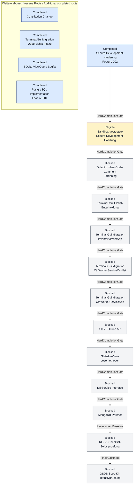

# Lastenheft-Abarbeitungsreihenfolge / Requirements Processing Order

Stand: 2026-08-30

## Zweck / Purpose

Diese Datei haelt die sinnvolle Abarbeitungsreihenfolge der vorhandenen
Lastenhefte fest. Sie ist eine Vorbereitung fuer spaetere Spec-Kit-Laeufe und
startet selbst keinen Lauf. Die Reihenfolge ist so gewaehlt, dass
Governance-Baselines vor grossen Codeaenderungen geklaert werden, danach die
Terminal.Gui-Migration gebuendelt laeuft und datenbanknahe Erweiterungen erst
nach den stabilisierenden Vorarbeiten folgen.

This file records the proposed processing order for the existing requirements
files. It prepares later Spec Kit runs and does not start a run by itself. The
order puts governance baselines before large code changes, then groups the
Terminal.Gui migration work, and schedules database-facing extensions after
the stabilizing preparation work.

## Aktive Reihenfolge / Active Order

| Rang | Lastenheft | Naechster Status / Next Status | Begruendung / Rationale |
|---:|---|---|---|
| 1 | `Lastenheft_Sandbox-gestuetzte-Secure-Development-Haertung.md` | Bearbeitbar, aber in diesem Lauf nicht starten / eligible, but do not start in this run | Feature 002 ist abgeschlossen; der Sandbox-Intake ist nur der nächste zulässige Kandidat und erhält in diesem Lauf weder Branch noch Spec, Plan, Tasks oder Run-State. Feature 002 is complete; the sandbox intake is only the next eligible candidate and receives no branch, spec, plan, tasks, or run state in this run. |
| 2 | `Lastenheft_Didactic-Inline-Code-Comment-Hardening.md` | Nach Security-Hardening spezifizieren / specify after security hardening | Didaktische Kommentarregeln sollten vor den groesseren Migrations- und Datenbankaenderungen stabil sein. Didactic comment rules should be stable before larger migration and database changes. |
| 3 | `Lastenheft_TG_Elmish_Entscheidung.md` | Vor Terminal.Gui-Codeaenderungen entscheiden / decide before Terminal.Gui code changes | Die Elmish-Entscheidung beeinflusst alle Terminal.Gui-v2-Migrationslaeufe und sollte nicht mehrfach getroffen werden. The Elmish decision affects all Terminal.Gui v2 migration runs and should not be made repeatedly. |
| 4 | `Lastenheft_TG_Migration_InventarViewerApp.md` | Erste operative TUI-Migration / first operative TUI migration | Der Viewer ist die fachlich komplexeste TUI-Flaeche und liefert Muster fuer MainLoop-, Dialog- und Testanpassungen. The viewer is the most complex TUI surface and creates patterns for MainLoop, dialog, and test changes. |
| 5 | `Lastenheft_TG_Migration_CtrlWorkerServiceCmdlet.md` | Nach Viewer-Muster migrieren / migrate after viewer pattern | Das Cmdlet hat PowerShell- und Terminal.Gui-Lebenszyklusgrenzen, profitiert aber von den Viewer-Erkenntnissen. The cmdlet has PowerShell and Terminal.Gui lifecycle boundaries, but benefits from the viewer findings. |
| 6 | `Lastenheft_TG_Migration_CtrlWorkerServiceApp.md` | Letzte operative TUI-Migration / final operative TUI migration | Die Service-App ist kleiner und kann die vorher festgelegten v2- und Elmish-Entscheidungen uebernehmen. The service app is smaller and can reuse the v2 and Elmish decisions from the earlier runs. |
| 7 | `Lastenheft_A11Y_TUI_API.md` | Nach TUI-Migration spezifizieren / specify after TUI migration | A11Y-Pruefungen fuer TUI und API sind belastbarer, wenn die Ziel-TUI-API bereits stabilisiert ist. A11y checks for TUI and API are more reliable after the target TUI API is stabilized. |
| 8 | `Lastenheft_Statistik_View_Lesemethoden.md` | Vor Interface-Schnitt spezifizieren / specify before interface cut | Die relationalen View-Lesemethoden erweitern die tatsaechliche Service-Oberflaeche und sollten vor dem Interface feststehen. The relational view read methods extend the actual service surface and should be known before the interface is cut. |
| 9 | `Lastenheft_IDbService_Interface.md` | Nach gereiftem relationalem Umfang spezifizieren / specify after relational scope matures | Das Interface sollte die bereinigten SQLite/PostgreSQL- und Statistik-Lesepfade abbilden, nicht einen Zwischenstand. The interface should reflect the cleaned SQLite/PostgreSQL and statistics read paths, not an intermediate state. |
| 10 | `Lastenheft_MongoDB_Paritaet.md` | Nach relationalem Interface pruefen / review after relational interface | MongoDB-Paritaet ist ein eigener Backend-Schnitt und sollte erst nach relationaler API-Klaerung geschnitten werden. MongoDB parity is its own backend boundary and should be scoped after the relational API is clear. |
| 11 | `Lastenheft_RL-SE-Checklist-Selbstpruefung.md` | Nach MongoDB-Paritaet pruefen / assess after MongoDB parity | Die Selbstpruefung bewertet den dann erreichten Entwicklungs- und Evidenzstand. The self-assessment evaluates the development and evidence state reached by that point. |
| 12 | `Lastenheft_GSDB-Spec-Kit-Intensivpruefung.md` | Als abschliessenden Audit ausfuehren / run as the final audit | Die Intensivpruefung verwendet die Ergebnisse aller vorherigen aktiven Laeufe als verbindliche Eingabe. The intensive audit uses the results of all preceding active runs as binding input. |

## Abgeschlossen oder nicht operativ / Completed or Non-Operative

| Lastenheft | Einordnung / Classification | Begruendung / Rationale |
|---|---|---|
| `Lastenheft_Secure-Development-Hardening.002-secure-development-hardening.md` | Abgeschlossen und branch-suffig archiviert / completed and archived with branch suffix | Der Lauf `002-secure-development-hardening` ist mit MergeAndSync und 122 von 122 abgeschlossenen Aufgaben vollständig geliefert. The `002-secure-development-hardening` run is fully delivered through MergeAndSync with 122 of 122 tasks completed. |
| `Lastenheft_PostgreSQL_Implementation.001-pgsql-paritaet.md` | Abgeschlossen und branch-suffig archiviert / completed and archived with branch suffix | Der Lauf `001-pgsql-paritaet` ist umgesetzt und in `specs/001-pgsql-paritaet/` dokumentiert. The `001-pgsql-paritaet` run is implemented and documented in `specs/001-pgsql-paritaet/`. |
| `Lastenheft_SQLite_ViewQuery_Bugfix.md` | Bereits im aktuellen Code geloest / already resolved in current code | Die betroffenen View-Abfragen verwenden im aktuellen `SqliteDbService` die View-Namen mit `ORDER BY Name`. The affected view queries in the current `SqliteDbService` use the view names with `ORDER BY Name`. |
| `Lastenheft_Constitution_Change.md` | Durch aktuelle Governance ueberholt / superseded by current governance | Die Kernpunkte sind durch Constitution, Agent-Guidance und Spec-Kit-Preset-Governance aktueller abgedeckt. The main points are covered more up to date by the constitution, agent guidance, and Spec Kit preset governance. |
| `Lastenheft_TerminalGui_Migration.md` | Uebersicht, kein einzelner Lauf / overview, not a single run | Die operative Arbeit ist in Entscheidung und drei konkrete TUI-Migrationslastenhefte aufgeteilt. The operative work is split into the decision file and three concrete TUI migration requirements files. |

## Nutzungsregel / Usage Rule

- Vor einem spaeteren Spec-Kit-Lauf wird das erste aktive, noch nicht
  abgearbeitete Lastenheft aus der Tabelle verwendet.
- Ein Lauf soll nur dann mehrere Lastenhefte zusammenfassen, wenn die Kopplung
  fachlich begruendet und vor dem Start dokumentiert ist.
- Nach Abschluss eines dedizierten Feature-Branches wird das gelieferte
  Lastenheft gemaess Repository-Regel mit Branch-Suffix umbenannt:
  `Lastenheft_<Thema>.<feature-branch>.md`.
- Wenn sich Status oder Reihenfolge aendern, wird diese Datei vor dem naechsten
  Spec-Kit-Lauf aktualisiert.
- Abhaengigkeiten duerfen zusaetzlich als Mermaid-Diagramm dargestellt werden.
  Eine vollstaendige textuelle Lesefassung steht immer unmittelbar davor;
  Status, Kantenart und Reihenfolge duerfen nicht nur durch Farbe vermittelt
  werden.

- Before a later Spec Kit run, use the first active requirements file that has
  not yet been processed.
- A run should combine multiple requirements files only when the coupling is
  justified by the domain and documented before the start.
- After a dedicated feature branch is completed, rename the delivered
  requirements file according to the repository rule:
  `Lastenheft_<Topic>.<feature-branch>.md`.
- If status or order changes, update this file before the next Spec Kit run.
- Dependencies may additionally be shown as a Mermaid diagram. A complete
  textual representation always appears immediately before it; status, edge
  type, and order must never rely on color alone.

## Pflegepruefung / Maintenance Check

Jedes der aktuell bekannten siebzehn Lastenhefte steht in dieser Datei genau
einmal in der aktiven Reihenfolge oder in der Status-Tabelle. Neue Lastenhefte
werden ergaenzt, sobald sie als spaeterer Spec-Kit-Input vorgesehen sind.

Each of the seventeen currently known requirements files appears exactly once in
the active order or in the status table. Add new requirements files as soon as
they are intended as input for a later Spec Kit run.

## Spec-Kit-Intake-Regel / Spec Kit Intake Rule

- Diese Datei ist ein Ordnungsdokument und selbst kein Spec-Kit-Intake.
- Aktive Lastenhefte ohne Feature-Branch-Suffix koennen als Intake dienen, wenn sie Scope, Nicht-Ziele, Anforderungen, Akzeptanzkriterien und einen kopierbaren `/speckit-specify`-Prompt enthalten.
- Lastenhefte mit Feature-Branch-Suffix wie `.001-*` oder `.009-*` gelten als historisch oder abgeschlossen und werden nicht erneut gestartet.
- Vor jedem neuen Lauf wird zuerst der aktuelle Repository-Stand geprueft; erledigte Punkte werden als `AlreadySatisfied` oder `N/A` dokumentiert, nicht neu implementiert.

- This file is an ordering document and not itself a Spec Kit intake.
- Active Lastenhefte without a feature-branch suffix can be used as intake when they include scope, non-goals, requirements, acceptance criteria, and a copyable `/speckit-specify` prompt.
- Lastenhefte with a feature-branch suffix such as `.001-*` or `.009-*` are historical or completed and are not started again.
- Before every new run, first check the current repository state; completed items are documented as `AlreadySatisfied` or `N/A`, not reimplemented.

<!-- secure-development-hardening-order:start -->
## Verlinkte Lastenheft-Reihenfolge / Linked Requirements Order

Diese Tabelle wird aus dem kanonischen Series-Manifest und ausdruecklicher Feature-Evidence erzeugt. Vollstaendige Dateinamen, direkte eingehende Kanten und sichtbare Positionen bleiben erhalten. Manuelle Abschnitte ausserhalb dieses Markers bleiben unberuehrt.

*This table is generated from the canonical series manifest and explicit feature evidence. Complete filenames, direct incoming edges, and visible positions are preserved. Manual sections outside this marker remain unchanged.*

| Position | Status | Lastenheft/Intake | Abhängigkeiten / Dependencies | Spec-Kit-Feature |
|---:|---|---|---|---|
| 1 | Completed | [Lastenheft_Secure-Development-Hardening.002-secure-development-hardening.md](Lastenheft_Secure-Development-Hardening.002-secure-development-hardening.md) | — (Root / keine direkte Abhängigkeit) | [002-secure-development-hardening](specs/002-secure-development-hardening/) |
| 2 | Eligible | [Lastenheft_Sandbox-gestuetzte-Secure-Development-Haertung.md](Lastenheft_Sandbox-gestuetzte-Secure-Development-Haertung.md) | [Lastenheft_Secure-Development-Hardening.002-secure-development-hardening.md](Lastenheft_Secure-Development-Hardening.002-secure-development-hardening.md) → current (`HardCompletionGate`, binding: true) | — (kein Spec-Kit-Feature / no Spec Kit feature) |
| 3 | Blocked | [Lastenheft_Didactic-Inline-Code-Comment-Hardening.md](Lastenheft_Didactic-Inline-Code-Comment-Hardening.md) | [Lastenheft_Sandbox-gestuetzte-Secure-Development-Haertung.md](Lastenheft_Sandbox-gestuetzte-Secure-Development-Haertung.md) → current (`HardCompletionGate`, binding: true) | — (kein Spec-Kit-Feature / no Spec Kit feature) |
| 4 | Blocked | [Lastenheft_TG_Elmish_Entscheidung.md](Lastenheft_TG_Elmish_Entscheidung.md) | [Lastenheft_Didactic-Inline-Code-Comment-Hardening.md](Lastenheft_Didactic-Inline-Code-Comment-Hardening.md) → current (`HardCompletionGate`, binding: true) | — (kein Spec-Kit-Feature / no Spec Kit feature) |
| 5 | Blocked | [Lastenheft_TG_Migration_InventarViewerApp.md](Lastenheft_TG_Migration_InventarViewerApp.md) | [Lastenheft_TG_Elmish_Entscheidung.md](Lastenheft_TG_Elmish_Entscheidung.md) → current (`HardCompletionGate`, binding: true) | — (kein Spec-Kit-Feature / no Spec Kit feature) |
| 6 | Blocked | [Lastenheft_TG_Migration_CtrlWorkerServiceCmdlet.md](Lastenheft_TG_Migration_CtrlWorkerServiceCmdlet.md) | [Lastenheft_TG_Migration_InventarViewerApp.md](Lastenheft_TG_Migration_InventarViewerApp.md) → current (`HardCompletionGate`, binding: true) | — (kein Spec-Kit-Feature / no Spec Kit feature) |
| 7 | Blocked | [Lastenheft_TG_Migration_CtrlWorkerServiceApp.md](Lastenheft_TG_Migration_CtrlWorkerServiceApp.md) | [Lastenheft_TG_Migration_CtrlWorkerServiceCmdlet.md](Lastenheft_TG_Migration_CtrlWorkerServiceCmdlet.md) → current (`HardCompletionGate`, binding: true) | — (kein Spec-Kit-Feature / no Spec Kit feature) |
| 8 | Blocked | [Lastenheft_A11Y_TUI_API.md](Lastenheft_A11Y_TUI_API.md) | [Lastenheft_TG_Migration_CtrlWorkerServiceApp.md](Lastenheft_TG_Migration_CtrlWorkerServiceApp.md) → current (`HardCompletionGate`, binding: true) | — (kein Spec-Kit-Feature / no Spec Kit feature) |
| 9 | Blocked | [Lastenheft_Statistik_View_Lesemethoden.md](Lastenheft_Statistik_View_Lesemethoden.md) | [Lastenheft_A11Y_TUI_API.md](Lastenheft_A11Y_TUI_API.md) → current (`HardCompletionGate`, binding: true) | — (kein Spec-Kit-Feature / no Spec Kit feature) |
| 10 | Blocked | [Lastenheft_IDbService_Interface.md](Lastenheft_IDbService_Interface.md) | [Lastenheft_Statistik_View_Lesemethoden.md](Lastenheft_Statistik_View_Lesemethoden.md) → current (`HardCompletionGate`, binding: true) | — (kein Spec-Kit-Feature / no Spec Kit feature) |
| 11 | Blocked | [Lastenheft_MongoDB_Paritaet.md](Lastenheft_MongoDB_Paritaet.md) | [Lastenheft_IDbService_Interface.md](Lastenheft_IDbService_Interface.md) → current (`HardCompletionGate`, binding: true) | — (kein Spec-Kit-Feature / no Spec Kit feature) |
| 12 | Blocked | [Lastenheft_RL-SE-Checklist-Selbstpruefung.md](Lastenheft_RL-SE-Checklist-Selbstpruefung.md) | [Lastenheft_MongoDB_Paritaet.md](Lastenheft_MongoDB_Paritaet.md) → current (`AssessmentBaseline`, binding: true) | — (kein Spec-Kit-Feature / no Spec Kit feature) |
| 13 | Blocked | [Lastenheft_GSDB-Spec-Kit-Intensivpruefung.md](Lastenheft_GSDB-Spec-Kit-Intensivpruefung.md) | [Lastenheft_RL-SE-Checklist-Selbstpruefung.md](Lastenheft_RL-SE-Checklist-Selbstpruefung.md) → current (`FinalAuditInput`, binding: true) | — (kein Spec-Kit-Feature / no Spec Kit feature) |
| 14 | Completed | [Lastenheft_Constitution_Change.md](Lastenheft_Constitution_Change.md) | — (Root / keine direkte Abhängigkeit) | — (kein Spec-Kit-Feature / no Spec Kit feature) |
| 15 | Completed | [Lastenheft_TerminalGui_Migration.md](Lastenheft_TerminalGui_Migration.md) | — (Root / keine direkte Abhängigkeit) | — (kein Spec-Kit-Feature / no Spec Kit feature) |
| 16 | Completed | [Lastenheft_SQLite_ViewQuery_Bugfix.md](Lastenheft_SQLite_ViewQuery_Bugfix.md) | — (Root / keine direkte Abhängigkeit) | — (kein Spec-Kit-Feature / no Spec Kit feature) |
| 17 | Completed | [Lastenheft_PostgreSQL_Implementation.001-pgsql-paritaet.md](Lastenheft_PostgreSQL_Implementation.001-pgsql-paritaet.md) | — (Root / keine direkte Abhängigkeit) | — (kein Spec-Kit-Feature / no Spec Kit feature) |
<!-- secure-development-hardening-order:end -->

## Text-first Seriensicht und Mermaid-Diagramm / Text-first Series View and Mermaid Diagram

Die bindende Hauptkette beginnt beim abgeschlossenen Secure-Development-
Hardening. Als naechster Kandidat ist ausschliesslich die Sandbox-Haertung
bearbeitbar. Danach folgen, jeweils noch blockiert: didaktische Inline-
Kommentare, Elmish-Entscheidung, die drei Terminal.Gui-Migrationen, A11Y,
Statistik-Lesemethoden, `IDbService`, MongoDB-Paritaet, RL-SE-Selbstpruefung
und die GSDB-Intensivpruefung. Die ersten zehn Kanten sind
`HardCompletionGate`; MongoDB zu RL-SE ist `AssessmentBaseline`, RL-SE zu
GSDB ist `FinalAuditInput`. Alle zwoelf Kanten sind bindend. Constitution,
Terminal.Gui-Uebersicht, SQLite-Bugfix und PostgreSQL-Implementierung sind
weitere abgeschlossene Roots ohne eingehende Kante.

*The binding main chain starts with the completed secure-development
hardening. Sandbox hardening is the only currently eligible candidate. The
following targets remain blocked: didactic inline comments, the Elmish
decision, three Terminal.Gui migrations, accessibility, statistics read
methods, `IDbService`, MongoDB parity, the RL-SE self-assessment, and the GSDB
intensive assessment. The first ten edges are `HardCompletionGate`; MongoDB to
RL-SE is `AssessmentBaseline`, and RL-SE to GSDB is `FinalAuditInput`. All
twelve edges are binding. Constitution, the Terminal.Gui overview, the SQLite
bugfix, and the PostgreSQL implementation are additional completed roots with
no incoming edge.*

