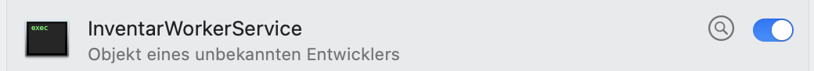
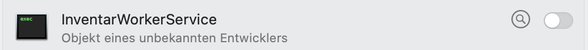

# InventarWorkerService mit .NET9/C# für Service für Windows, macOS und Linux

## Generelles Beispielprojekt
Gerne! Hier ist ein kleines Beispiel für ein plattformübergreifendes .NET Worker Service-Projekt, das unter Windows als Service, unter Linux als systemd-Daemon und unter macOS als launchd-Daemon laufen kann.

### 🧰 Schritt 1: Neues Worker-Projekt erstellen
```bash
dotnet new worker -n MyWorkerService
cd MyWorkerService
```
### 📝 Program.cs anpassen
```csharp
using Microsoft.Extensions.DependencyInjection;
using Microsoft.Extensions.Hosting;
using Microsoft.Extensions.Logging;

IHost host = Host.CreateDefaultBuilder(args)
.UseWindowsService()         // Aktiviert Windows-Dienstmodus
.UseSystemd()                // Aktiviert systemd-Unterstützung für Linux
.ConfigureServices(services =>
{
services.AddHostedService<Worker>();
})
.Build();

await host.RunAsync();
```
Die Methoden UseWindowsService() und UseSystemd() sind plattformabhängig – sie tun nichts, wenn die App auf der jeweiligen Plattform nicht läuft. Somit kannst du denselben Code auf allen drei Systemen nutzen!

### 🧠 Worker.cs (Beispiel-Logik)
```csharp
public class Worker : BackgroundService
{
private readonly ILogger<Worker> _logger;

    public Worker(ILogger<Worker> logger)
    {
        _logger = logger;
    }

    protected override async Task ExecuteAsync(CancellationToken stoppingToken)
    {
        while (!stoppingToken.IsCancellationRequested)
        {
            _logger.LogInformation("Worker läuft: {time}", DateTimeOffset.Now);
            await Task.Delay(5000, stoppingToken);
        }
    }
}
```
### 🧪 Test lokal:
```bash
dotnet run
```
### 📦 Veröffentlichen:
```bash
dotnet publish -c Release -r win-x64 --self-contained false    # Für Windows
dotnet publish -c Release -r linux-x64 --self-contained false  # Für Linux
dotnet publish -c Release -r osx-x64 --self-contained false    # Für macOS
```
## Schritt-für-Schritt-Anleitung für alle drei Plattformen
Beispiele für die .service-Datei für Linux, eine .plist für macOS für den Autostart und das Ganze als Windows Service zu registrieren.
Hier sind praktische Schritt-für-Schritt-Anleitung für alle drei Plattformen:

### 🐧 Linux/Ubuntu systemd .service-Datei
Erstelle die Datei:
```bash
sudo nano /etc/systemd/system/inventarworkerservice.service
```
Inhalt der Datei:
```ini
[Unit]
Description=Inventar Worker Service
After=network.target

[Service]
Type=notify
ExecStart=/pfad/zu/ihrer/app/InventarWorkerService
Restart=on-failure
RestartSec=5
KillSignal=SIGINT
SyslogIdentifier=inventarworkerservice
User=<aktueller_benutzername>
Environment=ASPNETCORE_ENVIRONMENT=Production
Environment=ASPNETCORE_URLS=http://localhost:5000

[Install]
WantedBy=multi-user.target
```
Dienst aktivieren und starten:
```bash
# Service aktivieren und starten
sudo systemctl enable inventarworkerservice.service
sudo systemctl start inventarworkerservice.service

# Status prüfen
sudo systemctl status inventarworkerservice.service

# Service stoppen
sudo systemctl stop inventarworkerservice.service
```
### 🍏 macOS LaunchAgent .plist-Datei
Datei erstellen unter:
```bash
nano ~/Library/LaunchAgents/com.inventarworkerservice.plist
```
Inhalt:
```xml
<?xml version="1.0" encoding="UTF-8"?>
<!DOCTYPE plist PUBLIC "-//Apple//DTD PLIST 1.0//EN" "http://www.apple.com/DTDs/PropertyList-1.0.dtd">
<plist version="1.0">
   <dict>
      <key>Label</key>
      <string>com.inventarworkerservice</string>
      <key>ProgramArguments</key>
      <array>
<string>/Users/thorstenhindermann/RiderProjects/InventarWorkerService/InventarWorkerService/bin/Debug/net9.0/InventarWorkerService</string>
      </array>
      <key>RunAtLoad</key>
      <true/>
      <key>KeepAlive</key>
      <true/>
      <!-- Arbeitsverzeichnis -->
      <key>WorkingDirectory</key>
      <string>/Users/thorstenhindermann/RiderProjects/InventarWorkerService/InventarWorkerService/bin/Debug/net9.0/</string>
    
      <!-- Umgebungsvariablen -->
      <key>EnvironmentVariables</key>
      <dict>
         <key>ASPNETCORE_ENVIRONMENT</key>
         <string>Development</string>
         <key>ASPNETCORE_URLS</key>
         <string>http://localhost:5000;https://localhost:5001</string>

         <!-- Detailliertes Logging aktivieren -->
         <key>ASPNETCORE_LOGGING__LOGLEVEL__DEFAULT</key>
         <string>Debug</string>
         
         <key>ASPNETCORE_LOGGING__LOGLEVEL__MICROSOFT</key>
         <string>Information</string>
         
         <key>ASPNETCORE_LOGGING__LOGLEVEL__MICROSOFT.HOSTING.LIFETIME</key>
         <string>Information</string>
         
         <!-- Console-Logging aktivieren -->
         <key>ASPNETCORE_LOGGING__CONSOLE__INCLUDESCOPES</key>
         <string>true</string>
         
         <!-- Swagger in allen Umgebungen aktivieren -->
         <key>ASPNETCORE_ENABLE_SWAGGER</key>
         <string>true</string>
         
         <!-- .NET Core Debug-Features -->
         <key>DOTNET_ENVIRONMENT</key>
         <string>Development</string>
         
         <!-- Zusätzliche Debug-Optionen -->
         <key>DOTNET_PRINT_TELEMETRY_MESSAGE</key>
         <string>false</string>
         
         <!-- Detaillierte Exception-Seiten -->
         <key>ASPNETCORE_DETAILEDERRORS</key>
         <string>true</string>
         
         <!-- Host-spezifische Debugging-URLs -->
         <key>ASPNETCORE_HOSTINGSTARTUPASSEMBLIES</key>
         <string></string>

      </dict>

      <key>StandardOutPath</key>
      <string>/Users/thorstenhindermann/Library/Logs/inventarworkerservice.log</string>
      <key>StandardErrorPath</key>
      <string>/Users/thorstenhindermann/Library/Logs/inventarworkerservice.error.log</string>

      <!-- Benutzer (nur für LaunchDaemons) -->
      <key>UserName</key>
      <string>thorstenhindermann</string>

      <!-- Netzwerk-Abhängigkeiten -->
      <key>LaunchOnlyOnce</key>
      <false/>
   </dict>
</plist>
```
Wenn die Datei erstellt ist, kannst du den Daemon aktivieren und starten üer die Einstellngen, da sich der Agendt dort gleich regisztriert und aufgelistet wird. Dieser wird in der Standardeinstellung bem Anmelden gleich mit gestartet.
Erreichbar unter `Systemeinstellungen > Allgemeinstellungen > Anmeldeobjekte & Erweiterungen`.



Über den Schalter rechts vom Namen kann der Agendt aktiviert oder deaktiviert werden. Aktuell im Bild ist dieser deaktiviert. Dies kann vom Nutzer selbst gesteuert werden.



#### Aktivieren des macOS Daemons
Agent aktivieren von der Kommandozeile:
!Achtung: Hier musss man sich mit der man-Page des `launchctl`-Befehls vertraut machen, da es hier Unterschiede gibt.
```bash
# Service laden
sudo launchctl load ~/Library/LaunchDaemons/com.inventarworkerservice.plist

# Service starten
sudo launchctl start com.inventarworkerservice

# Service stoppen
sudo launchctl stop com.inventarworkerservice

# Service entladen
sudo launchctl unload ~/Library/LaunchDaemons/com.inventarworkerservice.plist```
```
### Windows Service
### 🪟 Windows Service installieren und registrieren
Veröffentlichen:
```bash
dotnet publish -c Release -r win-x64 --self-contained false
```
#### Installieren mit sc.exe:
Das Terminal, die PowerShell oder Kommandozeile als Administrator öffnen und den Service mit `sc.exe` registrieren.
```cmd
sc create "InventarWorkerService" binPath= "C:\Users\hinde\RiderProjects\InventarWorkerService\InventarWorkerService\bin\Debug\net9.0\InventarWorkerService.exe"
```
Die erfolgreiche Installation wird mit `[SC] CreateService SUCCESS` oder `[SC] CreateService ERFOLG` bestätigt.

Der Dienste-Eintrag in der services.msc-Ansicht in der mmc.exe ist dann sichtbar wie im Bild dargestellt:


Alternativ via PowerShell mit New-Service:
```powershell
New-Service -Name "InventarWorkerService" `
            -BinaryPathName "C:\Users\hinde\RiderProjects\InventarWorkerService\InventarWorkerService\bin\Debug\net9.0\InventarWorkerService.exe" `
            -DisplayName "InventarWorkerService" `
            -StartupType Automatic
```
Starten:
```cmd
net start InventarWorkerService
```
Der erfolgreiche Start wird mit der folgenden Meldung quittiert:
```cmd
SERVICE_NAME: InventarWorkerService
        TYPE               : 10  WIN32_OWN_PROCESS
        STATE              : 2  START_PENDING
                                (NOT_STOPPABLE, NOT_PAUSABLE, IGNORES_SHUTDOWN)
        WIN32_EXIT_CODE    : 0  (0x0)
        SERVICE_EXIT_CODE  : 0  (0x0)
        CHECKPOINT         : 0x0
        WAIT_HINT          : 0x7d0
        PID                : 48224
        FLAGS              :
```
Der Dienste-Eintrag in der services.msc-Ansicht in der mmc.exe ist dann sichtbar wie im Bild dargestellt:

Außerdem kann in der Ansicht der Dienst auch von diesem Dienstprogramm gestartet werden.


Service stoppen
```cmd
sc stop "InventarWorkerService"
```
Der erfolgreiche Start wird mit der folgenden Meldung quittiert:
```cmd
SERVICE_NAME: InventarWorkerService
        TYPE               : 10  WIN32_OWN_PROCESS
        STATE              : 3  STOP_PENDING
                                (STOPPABLE, NOT_PAUSABLE, ACCEPTS_SHUTDOWN)
        WIN32_EXIT_CODE    : 0  (0x0)
        SERVICE_EXIT_CODE  : 0  (0x0)
        CHECKPOINT         : 0x0
        WAIT_HINT          : 0x0
```
Der Dienste-Eintrag in der services.msc-Ansicht in der mmc.exe ist dann sichtbar wie im Bild dargestellt:

Außerdem kann in der Ansicht der Dienst auch von diesem Dienstprogramm gestoppt oder neu gestartet werden.

Service deinstallieren
```cmd
sc delete "InventarWorkerService"
```

### FreeBSD (rc.d)
Erstellen Sie ein rc.d-Skript `/usr/local/etc/rc.d/inventarworkerservice`:

```bash
#!/bin/sh

# PROVIDE: inventarworkerservice
# REQUIRE: LOGIN
# KEYWORD: shutdown

. /etc/rc.subr

name="inventarworkerservice"
rcvar="inventarworkerservice_enable"

command="/pfad/zu/ihrer/app/InventarWorkerService"
pidfile="/var/run/inventarworkerservice.pid"

load_rc_config $name
run_rc_command "$1"
```
Service in `/etc/rc.conf` aktivieren:
```bash
# In /etc/rc.conf hinzufügen
inventarworkerservice_enable="YES"

# Service starten
service inventarworkerservice start

# Service stoppen  
service inventarworkerservice stop
```
Mit diesen Änderungen kann Ihre Anwendung als nativer Service auf allen genannten Betriebssystemen ausgeführt werden.

## Verwendung der CtrlWorkerServiceApp
Die `CtrlWorkerServiceApp` ist eine einfache Konsolenanwendung, die den Worker Service startet und verwaltet. Sie können sie verwenden, um den Service zu starten, zu stoppen und den Status abzufragen.
### Beispiel für die Verwendung
```bash
# Service starten
CtrlWorkerServiceApp start

# Service stoppen
CtrlWorkerServiceApp stop

# Hilfe anzeigen
CtrlWorkerServiceApp --help
```

## Eine kompakte Beispielstruktur für dein plattformübergreifendes Worker-Service-Projekt inklusive Konfigs und Setup-Skripten für Windows, Linux und macOS.

### 📁 Projektstruktur (Vorschlag)
```plaintext
MyWorkerService/
├── Worker.cs
├── Program.cs
├── MyWorkerService.csproj
├── configs/
│   ├── linux/
│   │   └── myworker.service
│   ├── macos/
│   │   └── com.example.myworker.plist
│   └── windows/
│       └── install_service.ps1
├── setup/
│   ├── setup_linux.sh
│   └── setup_macos.sh
```
### 🐧 setup_linux.sh (für systemd)
```bash
#!/bin/bash
SERVICE_NAME=myworker
USER_NAME=$USER
APP_DIR=/opt/myworker
DLL_PATH=$APP_DIR/MyWorkerService.dll

sudo mkdir -p "$APP_DIR"
sudo cp -r ./bin/Release/netX.X/publish/* "$APP_DIR"

sudo cp ./configs/linux/myworker.service /etc/systemd/system/$SERVICE_NAME.service
sudo sed -i "s|/pfad/zu/MyWorkerService.dll|$DLL_PATH|" /etc/systemd/system/$SERVICE_NAME.service
sudo sed -i "s|deinbenutzername|$USER_NAME|" /etc/systemd/system/$SERVICE_NAME.service

sudo systemctl daemon-reexec
sudo systemctl enable $SERVICE_NAME
sudo systemctl start $SERVICE_NAME
```
### 🍏 setup_macos.sh (für launchd)
```bash
#!/bin/bash
PLIST_NAME=com.example.myworker.plist
PLIST_TARGET=~/Library/LaunchAgents/$PLIST_NAME
APP_PATH="$(pwd)/bin/Release/netX.X/publish/MyWorkerService.dll"

cp ./configs/macos/$PLIST_NAME "$PLIST_TARGET"
sed -i '' "s|/Pfad/zu/MyWorkerService.dll|$APP_PATH|" "$PLIST_TARGET"

launchctl load "$PLIST_TARGET"
```
### 🪟 install_service.ps1 (für Windows)
```powershell
$serviceName = "MyWorkerService"
$displayName = "My .NET Worker Service"
$exePath = "C:\Pfad\zu\dotnet.exe C:\Pfad\zu\MyWorkerService.dll"

New-Service -Name $serviceName `
    -BinaryPathName $exePath `
    -DisplayName $displayName `
    -StartupType Automatic

Start-Service $serviceName
```

## 🧱 Schritt-für-Schritt: Dein eigenes .zip bauen
Erstelle die Projektstruktur:
```bash
dotnet new worker -n MyWorkerService
cd MyWorkerService
```
Füge die zusätzlichen Ordner und Dateien ein:
```bash
mkdir -p configs/linux configs/macos configs/windows setup
```
Kopiere den Inhalt aus meiner vorherigen Antwort in folgende Dateien:
```plaintext
configs/linux/myworker.service
configs/macos/com.example.myworker.plist
configs/windows/install_service.ps1
setup/setup_linux.sh
setup/setup_macos.sh
```
Passe Program.cs und Worker.cs gemäß dem plattformübergreifenden Worker-Modell an (siehe oben).

Erstelle das .zip-Archiv (z.B. auf macOS/Linux):
```bash
cd ..
zip -r MyWorkerService.zip MyWorkerService/
```
Oder auf Windows (in PowerShell):
```powershell
Compress-Archive -Path .\MyWorkerService\* -DestinationPath .\MyWorkerService.zip
```

## Verwendung der REST API
Nach der Implementierung können Sie den Service folgendermaßen abfragen:
### Beispiel-Aufrufe:
1. **Service Status**: `GET http://[IP-Adresse]:5000/api/inventar/status`
2. **Hardware Inventar**: `GET http://[IP-Adresse]:5000/api/inventar/hardware`
3. **Software Inventar**: `GET http://[IP-Adresse]:5000/api/inventar/software`
4. **Komplettes Inventar**: `GET http://[IP-Adresse]:5000/api/inventar/full`

### Mit curl
```bash
curl -X GET "http://192.168.1.100:5000/api/inventar/full" \
  -H "accept: application/json"
```

### Mit PowerShell
```powershell
Invoke-RestMethod -Uri "http://192.168.1.100:5000/api/inventar/full" -Method Get
```
### Mit Swagger
Die Swagger UI ist unter `http://[IP-Adresse]:5000/swagger` verfügbar und bietet eine interaktive Dokumentation der API.

## 🚀 Verwendung des .http Files
1. **Speichern Sie die Datei** als `api-tests.http` in Ihrem Projekt
2. **In JetBrains Rider** können Sie:
    - Auf den grünen "Play"-Button neben jeder Anfrage klicken
    - `Ctrl+Enter` (Windows/Linux) oder `Cmd+Enter` (macOS) verwenden
    - Über das Kontextmenü "Run" auswählen

### 📝 Anpassungen
- **IP-Adressen**: Ändern Sie `192.168.1.100` zu Ihrer tatsächlichen Server-IP
- **Port**: Falls Ihr Service auf einem anderen Port läuft, passen Sie `5000` entsprechend an
- **Endpoints**: Fügen Sie weitere API-Endpunkte hinzu, falls vorhanden

### 🔧 Erweiterte Features
Das File nutzt:
- **Variablen** (`@baseUrl`, `@remoteUrl`) für einfache Umgebungsumschaltung
- **Dynamische Werte** (`{{$timestamp}}`) für eindeutige Request-IDs
- **Mehrere Umgebungen** (lokal, remote)
- **Verschiedene Content-Types** und Headers

So können Sie systematisch alle Ihre API-Endpunkte testen!

## 📦 SQLite PowerShell Provider - läuft nur unter Windows!
Ein Beispiel dafür ist das Modul namens SQLite von Code Owls LLC, verfügbar in der PowerShell Gallery.
### 🔧 Funktionen
* Nutzt SQLite-Datenbanken als virtuelle PowerShell-Laufwerke
* Ermöglicht Navigation und Manipulation von Tabellen wie bei Dateisystemobjekten
* Unterstützt Standard-Cmdlets wie Get-ChildItem, New-Item, Remove-Item, etc.
### 🚀 Installation
```powershell
Install-Module -Name SQLite
```
### 📁 Beispiel: Datenbank als Laufwerk einbinden
```powershell
New-PSDrive -Name MyDB -PSProvider SQLite -Root "C:\Pfad\zur\Datenbank.db"
Set-Location MyDB:\Tables
Get-ChildItem
```
Damit kannst du Tabellen wie Ordner durchsuchen und sogar direkt mit den Daten arbeiten.
Wenn du magst, zeige ich dir ein konkretes Beispiel, wie du Daten aus einer Tabelle abfragen oder bearbeiten kannst. Was hast du vor?

## Beispiel zum Abfragen von Daten mit dem SQLite Cmdlet Provider
Wenn du den SQLite Cmdlet Provider aus dem PowerShell Gallery Modul SQLite installiert hast und ein SQLite-Datenbanklaufwerk eingebunden wurde, kannst du mit PowerShell ganz einfach Daten abfragen.
### 📋 Beispiel: Abfrage von Datensätzen aus einer Tabelle
Angenommen, du hast eine Tabelle namens users in deiner Datenbank. So könntest du die Daten darin anzeigen:
#### Datenbank als Laufwerk einbinden
```powershell
New-PSDrive -Name MyDB -PSProvider SQLite -Root "C:\Pfad\zur\Datenbank.db"
```
#### In den Tabellen-Ordner wechseln
```powershell
Set-Location MyDB:\Tables\users
```
#### Alle Datensätze aus der Tabelle anzeigen
```powershell
Get-ChildItem
```
### 🧠 Was passiert hier?
* `New-PSDrive`: Bindet die SQLite-DB als Laufwerk namens MyDB ein
* `Set-Location`: Navigiert zur Tabelle users innerhalb des Laufwerks
* `Get-ChildItem`: Holt alle Datensätze (also die Rows) aus der Tabelle
#### ✨ Bonus: Nur bestimmte Felder anzeigen
Du kannst auch bestimmte Felder abfragen, z.B.:
```powershell
Get-ChildItem | Select-Object Firstname, Lastname
```
#### Oder mit Where-Object filtern:
```powershell
Get-ChildItem | Where-Object { $_.City -eq "Berlin" }
```

## ✅ Beste Alternative für PowerShell Core: `PSSQLite`
Für PowerShell Core gibt es aktuell keinen SQLite Cmdlet Provider, der wie ein Dateisystem funktioniert (also mit New-PSDrive, Get-ChildItem, etc.). Die bekannten Provider wie das SQLite-Modul von Code Owls LLC sind nicht kompatibel mit PowerShell Core, da sie auf Windows-spezifische .NET Framework-Komponenten setzen.

Das Modul PSSQLite funktioniert plattformübergreifend – also auch unter macOS und Linux – und bietet Cmdlets wie Invoke-SqliteQuery, mit denen du direkt SQL-Abfragen ausführen kannst.
### 🔧 Beispiel:
```powershell
Install-Module -Name PSSQLite -Scope CurrentUser

$db = "./MeineDatenbank.sqlite"
$query = "SELECT * FROM users"
Invoke-SqliteQuery -DataSource $db -Query $query
```
Das ist zwar kein Provider im klassischen Sinne, aber du bekommst vollen Zugriff auf die Datenbankinhalte – und das ganz ohne Windows-Abhängigkeiten.
Wenn du magst, helfe ich dir beim Einrichten oder zeige dir, wie du Tabellen erstellst, Daten einfügst oder filterst. Was möchtest du mit SQLite machen?

### 🛠️ Erweiterte Beispiele von PSSQLite:
Das Modul PSSQLite bietet dir eine flexible Möglichkeit, SQLite-Datenbanken direkt aus PowerShell heraus zu verwalten – und das plattformübergreifend. Hier sind einige erweiterte Beispiele, die dir zeigen, wie du Tabellen erstellen, Daten einfügen, abfragen und sogar große Datenmengen effizient verarbeiten kannst.
#### 🧱 1. Tabelle erstellen
```powershell
$db = "./MeineDatenbank.sqlite"
$query = @"
CREATE TABLE users (
UserId INTEGER PRIMARY KEY AUTOINCREMENT,
Firstname TEXT NOT NULL,
Lastname TEXT NOT NULL,
Birthdate DATE
)
"@
Invoke-SqliteQuery -DataSource $db -Query $query
```
#### ✍️ 2. Einzelne Datensätze einfügen
```powershell
$query = "INSERT INTO users (Firstname, Lastname, Birthdate) VALUES (@fn, @ln, @bd)"
$params = @{ fn = "Thorsten"; ln = "Beispiel"; bd = (Get-Date).AddYears(-30).ToString("yyyy-MM-dd") }
Invoke-SqliteQuery -DataSource $db -Query $query -SqlParameters $params
```
#### 🔍 3. Daten abfragen und filtern
```powershell
$query = "SELECT * FROM users WHERE Lastname = @ln"
$params = @{ ln = "Beispiel" }
Invoke-SqliteQuery -DataSource $db -Query $query -SqlParameters $params
```
#### 🚀 4. Große Datenmengen effizient einfügen (Bulk Insert)
```powershell
# Beispiel-Daten generieren
$data = 1..1000 | ForEach-Object {
   [pscustomobject]@{
   Firstname = "Vorname$_"
   Lastname = "Nachname$_"
   Birthdate = (Get-Date).AddDays(-$_).ToString("yyyy-MM-dd")
   }
}

# In DataTable konvertieren
$dataTable = $data | Out-DataTable

# Bulk Copy ausführen
Invoke-SQLiteBulkCopy -DataTable $dataTable -DataSource $db -Table users -NotifyAfter 100 -Verbose
```
#### 🧠 5. Tabellenstruktur anzeigen
```powershell
Invoke-SqliteQuery -DataSource $db -Query "PRAGMA table_info(users)"
```

### Weitere Beispiele für erweiterte PSSQLite Funktionen:
Hier kommt eine geballte Ladung SQLite-Power – alles direkt nutzbar mit dem PSSQLite-Modul in PowerShell Core. Ich zeige dir, wie du Views, Indizes, Trigger erstellst und die Struktur deiner Datenbank analysierst – ganz ohne GUI.
#### 🧩 1. View erstellen – Wiederverwendbare Abfragen
Ein View ist eine gespeicherte SQL-Abfrage, die du wie eine Tabelle behandeln kannst.
```powershell
$query = @"
CREATE VIEW active_users AS
SELECT UserId, Firstname, Lastname
FROM users
WHERE IsActive = 1
"@
Invoke-SqliteQuery -DataSource $db -Query $query
```
##### 🔎 Abfragen:
```powershell
Invoke-SqliteQuery -DataSource $db -Query "SELECT * FROM active_users"
``
#### 🚀 2. Index erstellen – Performance-Booster
Ein Index beschleunigt Suchabfragen auf bestimmten Spalten.
```powershell
$query = "CREATE INDEX idx_lastname ON users(Lastname)"
Invoke-SqliteQuery -DataSource $db -Query $query
```
💡 Tipp: Nutze EXPLAIN QUERY PLAN zur Analyse, ob dein Index verwendet wird.
#### ⚡ 3. Trigger erstellen – Automatisierte Aktionen
Ein Trigger reagiert auf INSERT, UPDATE oder DELETE und führt automatisch SQL aus.
```powershell
$query = @"
CREATE TRIGGER log_insert
AFTER INSERT ON users
FOR EACH ROW
BEGIN
INSERT INTO user_log (UserId, Action, Timestamp)
VALUES (NEW.UserId, 'INSERT', DATETIME('now'));
END;
"@
Invoke-SqliteQuery -DataSource $db -Query $query
```
#### 🧠 4. Datenbankstruktur dynamisch analysieren
##### 🔍 Tabellen auflisten
```powershell
Invoke-SqliteQuery -DataSource $db -Query "SELECT name FROM sqlite_master WHERE type='table'"
```
##### 📐 Spalten einer Tabelle anzeigen
```powershell
Invoke-SqliteQuery -DataSource $db -Query "PRAGMA table_info(users)"
```
##### 🧬 Views, Trigger und Indizes auflisten
```powershell
Invoke-SqliteQuery -DataSource $db -Query "SELECT name FROM sqlite_master WHERE type='view'"
Invoke-SqliteQuery -DataSource $db -Query "SELECT name FROM sqlite_master WHERE type='trigger'"
Invoke-SqliteQuery -DataSource $db -Query "SELECT name FROM sqlite_master WHERE type='index'"
```

### 📜 PowerShell-Skript: SQLite-Datenbankstruktur dokumentieren
Hier ist ein PowerShell-Skript, das mit dem PSSQLite-Modul die Struktur deiner SQLite-Datenbank analysiert und dokumentiert – inklusive Tabellen, Spalten, Views, Indizes und Trigger. Die Ausgabe erfolgt als Markdown-Datei, die du z. B. in GitHub oder VS Code schön lesen kannst.
```powershell
# Pfad zur SQLite-Datenbank
$dbPath = "./MeineDatenbank.sqlite"
$outputFile = "./DatenbankDokumentation.md"

# Funktion zum Ausführen von SQL-Abfragen
function Run-Query($query) {
Invoke-SqliteQuery -DataSource $dbPath -Query $query
}

# Starte Dokumentation
@"
# 📘 SQLite-Datenbankstruktur
**Datenbank:** $dbPath  
**Erstellt am:** $(Get-Date -Format "yyyy-MM-dd HH:mm:ss")

"@ | Out-File $outputFile -Encoding UTF8

# Tabellen auflisten
$tables = Run-Query "SELECT name FROM sqlite_master WHERE type='table' AND name NOT LIKE 'sqlite_%'"
Add-Content $outputFile "`n## 📂 Tabellen"
foreach ($table in $tables) {
    Add-Content $outputFile "`n### 🧱 Tabelle: $($table.name)"
$columns = Run-Query "PRAGMA table_info([$($table.name)])"
Add-Content $outputFile "| Spalte | Typ | Nullable | Default |"
Add-Content $outputFile "|--------|-----|----------|---------|"
foreach ($col in $columns) {
$nullable = if ($col.notnull -eq 0) { "✅" } else { "❌" }
Add-Content $outputFile "| $($col.name) | $($col.type) | $nullable | $($col.dflt_value) |"
}
}

# Views
$views = Run-Query "SELECT name, sql FROM sqlite_master WHERE type='view'"
if ($views.Count -gt 0) {
Add-Content $outputFile "`n## 👁️ Views"
    foreach ($view in $views) {
        Add-Content $outputFile "`n### View: $($view.name)`n```sql`n$($view.sql)`n```"
}
}

# Indizes
$indexes = Run-Query "SELECT name, tbl_name, sql FROM sqlite_master WHERE type='index' AND sql IS NOT NULL"
if ($indexes.Count -gt 0) {
Add-Content $outputFile "`n## 📌 Indizes"
    foreach ($idx in $indexes) {
        Add-Content $outputFile "`n### Index: $($idx.name) auf Tabelle $($idx.tbl_name)`n```sql`n$($idx.sql)`n```"
}
}

# Trigger
$triggers = Run-Query "SELECT name, tbl_name, sql FROM sqlite_master WHERE type='trigger'"
if ($triggers.Count -gt 0) {
Add-Content $outputFile "`n## ⚙️ Trigger"
    foreach ($trg in $triggers) {
        Add-Content $outputFile "`n### Trigger: $($trg.name) auf Tabelle $($trg.tbl_name)`n```sql`n$($trg.sql)`n```"
}
}

Write-Host "✅ Dokumentation erstellt: $outputFile"
```
Dieses Skript erzeugt eine gut lesbare Markdown-Datei mit allen relevanten Strukturelementen deiner Datenbank. Du kannst es natürlich anpassen – z.B. für HTML, CSV oder direktes Reporting.

### 🛠️ Erweiterungen im Skript
Hier kommt die erweiterte Version deines PowerShell-Skripts mit Statistiken, Foreign Keys und Beispielabfragen – alles dokumentiert in deiner Markdown-Datei. Damit erhältst du eine vollständige Übersicht über die Struktur und Beziehungen deiner SQLite-Datenbank.

#### 📊 1. Tabellenstatistiken (Anzahl Datensätze)
```powershell
Add-Content $outputFile "`n## 📊 Tabellenstatistiken"
foreach ($table in $tables) {
    $countQuery = "SELECT COUNT(*) AS Count FROM [$($table.name)]"
    $count = Run-Query $countQuery
    Add-Content $outputFile "`n**$($table.name):** $($count.Count) Datensätze"
}
```
#### 🔗 2. Foreign Keys anzeigen
```powershell
Add-Content $outputFile "`n## 🔗 Foreign Keys"
foreach ($table in $tables) {
    $fks = Run-Query "PRAGMA foreign_key_list([$($table.name)])"
    if ($fks.Count -gt 0) {
        Add-Content $outputFile "`n### Tabelle: $($table.name)"
        Add-Content $outputFile "| Von-Spalte | Ziel-Tabelle | Ziel-Spalte | On Update | On Delete |"
        Add-Content $outputFile "|------------|--------------|-------------|-----------|-----------|"
        foreach ($fk in $fks) {
            Add-Content $outputFile "| $($fk.from) | $($fk.table) | $($fk.to) | $($fk.on_update) | $($fk.on_delete) |"
        }
    }
}
```
#### 🧪 3. Beispielabfragen pro Tabelle
```powershell
Add-Content $outputFile "`n## 🧪 Beispielabfragen"
foreach ($table in $tables) {
    $columns = Run-Query "PRAGMA table_info([$($table.name)])"
    $firstCol = $columns[0].name
    $query = "SELECT $firstCol FROM [$($table.name)] LIMIT 5"
    Add-Content $outputFile "`n### $($table.name)`n```sql`n$query`n```"
}
```
#### ✅ Ergebnis
Die Markdown-Datei enthält jetzt:
* Tabellenübersicht mit Spalten
* Views, Indizes, Trigger
* Foreign Key-Beziehungen
* Datensatzanzahl pro Tabelle
* Beispielhafte SELECT-Abfragen

### Abschließende Features des PSSQLite-Skripts:
Jetzt wird dein SQLite-Dokumentationsskript richtig mächtig. Ich erweitere es um die folgenden Features:
#### 🌳 1. Referenzierte Tabellenbaumstruktur
Wir analysieren Foreign Keys und bauen eine einfache Baumstruktur, die zeigt, welche Tabellen andere referenzieren.
```powershell
Add-Content $outputFile "`n## 🌳 Tabellenabhängigkeiten"

foreach ($table in $tables) {
   $fks = Run-Query "PRAGMA foreign_key_list([$($table.name)])"
   if ($fks.Count -gt 0) {
      Add-Content $outputFile "`n**$($table.name)** referenziert:"
      foreach ($fk in $fks) {
         Add-Content $outputFile "- ➤ `$($fk.table)` über `$($fk.from)` → `$($fk.to)`"
      }
   }
}
```
#### 🌐 2. HTML-Dokumentation mit Formatierung
Zusätzlich zur Markdown-Datei kannst du eine HTML-Version erzeugen. Beispiel:
```powershell
$htmlFile = "./DatenbankDokumentation.html"
$htmlHeader = @"
<!DOCTYPE html>
<html>
<head>
  <meta charset='UTF-8'>
  <title>SQLite-Dokumentation</title>
  <style>
    body { font-family: sans-serif; margin: 2em; }
    h2, h3 { color: #2c3e50; }
    table { border-collapse: collapse; width: 100%; margin-bottom: 1em; }
    th, td { border: 1px solid #ccc; padding: 0.5em; text-align: left; }
    th { background-color: #f5f5f5; }
  </style>
</head>
<body>
<h1>📘 SQLite-Datenbankstruktur</h1>
<p><strong>Datenbank:</strong> $dbPath<br><strong>Erstellt am:</strong> $(Get-Date)</p>
"@
$htmlHeader | Out-File $htmlFile -Encoding UTF8
```
Dann kannst du die Tabellenstruktur und Inhalte als HTML-Elemente hinzufügen – z.B. mit `Add-Content $htmlFile "<table>...</table>"`.

### Dokumentation einer SQLite-Datenbankstruktur
Hier ist dein vollständiges PowerShell-Skript zur automatischen Dokumentation einer SQLite-Datenbankstruktur inklusive:
Tabellen, Spalten, Views, Indizes, Trigger
Foreign Keys und Tabellenabhängigkeiten
Beispielabfragen und Statistiken
Markdown- und HTML-Export
PDF-Erzeugung über Microsoft Word (sofern verfügbar)
#### 📁 Datei: Dokumentiere-SQLite.ps1
```powershell
# SQLite-Dokumentation mit PSSQLite
# Autor: Copilot für Thorsten

# Voraussetzungen: PSSQLite-Modul
Import-Module PSSQLite

$dbPath = "./MeineDatenbank.sqlite"
$mdFile = "./DatenbankDokumentation.md"
$htmlFile = "./DatenbankDokumentation.html"
$pdfFile = "C:\Temp\DatenbankDokumentation.pdf"

function Run-Query($query) {
Invoke-SqliteQuery -DataSource $dbPath -Query $query
}

# Markdown-Dokumentation starten
@"
# 📘 SQLite-Datenbankstruktur
**Datenbank:** $dbPath  
**Erstellt am:** $(Get-Date -Format "yyyy-MM-dd HH:mm:ss")
"@ | Out-File $mdFile -Encoding UTF8

$tables = Run-Query "SELECT name FROM sqlite_master WHERE type='table' AND name NOT LIKE 'sqlite_%'"

# Tabellenstruktur
Add-Content $mdFile "`n## 📂 Tabellen"
foreach ($table in $tables) {
    Add-Content $mdFile "`n### 🧱 Tabelle: $($table.name)"
$columns = Run-Query "PRAGMA table_info([$($table.name)])"
Add-Content $mdFile "| Spalte | Typ | Nullable | Default |"
Add-Content $mdFile "|--------|-----|----------|---------|"
foreach ($col in $columns) {
$nullable = if ($col.notnull -eq 0) { "✅" } else { "❌" }
Add-Content $mdFile "| $($col.name) | $($col.type) | $nullable | $($col.dflt_value) |"
}
}

# Tabellenstatistiken
Add-Content $mdFile "`n## 📊 Tabellenstatistiken"
foreach ($table in $tables) {
    $count = Run-Query "SELECT COUNT(*) AS Count FROM [$($table.name)]"
    Add-Content $mdFile "`n**$($table.name):** $($count.Count) Datensätze"
}

# Foreign Keys
Add-Content $mdFile "`n## 🔗 Foreign Keys"
foreach ($table in $tables) {
    $fks = Run-Query "PRAGMA foreign_key_list([$($table.name)])"
    if ($fks.Count -gt 0) {
        Add-Content $mdFile "`n### Tabelle: $($table.name)"
Add-Content $mdFile "| Von-Spalte | Ziel-Tabelle | Ziel-Spalte | On Update | On Delete |"
Add-Content $mdFile "|------------|--------------|-------------|-----------|-----------|"
foreach ($fk in $fks) {
Add-Content $mdFile "| $($fk.from) | $($fk.table) | $($fk.to) | $($fk.on_update) | $($fk.on_delete) |"
}
}
}

# Tabellenabhängigkeiten
Add-Content $mdFile "`n## 🌳 Tabellenabhängigkeiten"
foreach ($table in $tables) {
    $fks = Run-Query "PRAGMA foreign_key_list([$($table.name)])"
    if ($fks.Count -gt 0) {
        Add-Content $mdFile "`n**$($table.name)** referenziert:"
foreach ($fk in $fks) {
Add-Content $mdFile "- ➤ `$($fk.table)` über `$($fk.from)` → `$($fk.to)`"
}
}
}

# Beispielabfragen
Add-Content $mdFile "`n## 🧪 Beispielabfragen"
foreach ($table in $tables) {
    $columns = Run-Query "PRAGMA table_info([$($table.name)])"
    $firstCol = $columns[0].name
    $query = "SELECT $firstCol FROM [$($table.name)] LIMIT 5"
    Add-Content $mdFile "`n### $($table.name)`n```sql`n$query`n```"
}

# Views, Indizes, Trigger
$views = Run-Query "SELECT name, sql FROM sqlite_master WHERE type='view'"
if ($views.Count -gt 0) {
Add-Content $mdFile "`n## 👁️ Views"
    foreach ($view in $views) {
        Add-Content $mdFile "`n### View: $($view.name)`n```sql`n$($view.sql)`n```"
}
}

$indexes = Run-Query "SELECT name, tbl_name, sql FROM sqlite_master WHERE type='index' AND sql IS NOT NULL"
if ($indexes.Count -gt 0) {
Add-Content $mdFile "`n## 📌 Indizes"
    foreach ($idx in $indexes) {
        Add-Content $mdFile "`n### Index: $($idx.name) auf Tabelle $($idx.tbl_name)`n```sql`n$($idx.sql)`n```"
}
}

$triggers = Run-Query "SELECT name, tbl_name, sql FROM sqlite_master WHERE type='trigger'"
if ($triggers.Count -gt 0) {
Add-Content $mdFile "`n## ⚙️ Trigger"
    foreach ($trg in $triggers) {
        Add-Content $mdFile "`n### Trigger: $($trg.name) auf Tabelle $($trg.tbl_name)`n```sql`n$($trg.sql)`n```"
}
}

Write-Host "✅ Markdown-Dokumentation erstellt: $mdFile"

# HTML aus Markdown generieren (optional mit Pandoc)
if (Get-Command pandoc -ErrorAction SilentlyContinue) {
pandoc $mdFile -f markdown -t html -o $htmlFile
Write-Host "🌐 HTML-Datei erstellt: $htmlFile"
}

# PDF aus HTML generieren (über Word COM-Objekt, nur Windows)
if ($IsWindows) {
$Word = New-Object -ComObject Word.Application
$Word.Visible = $false
$Doc = $Word.Documents.Open((Resolve-Path $htmlFile))
$Doc.SaveAs([ref] $pdfFile, [ref] 17)
$Doc.Close()
$Word.Quit()
Write-Host "📄 PDF-Datei erstellt: $pdfFile"
} else {
Write-Host "⚠️ PDF-Export nur unter Windows mit Microsoft Word möglich."
}
```

#### 📦 Hinweise
* Für den PDF-Export brauchst du Microsoft Word und Windows. Alternativ kannst du pandoc mit wkhtmltopdf kombinieren.
* Das Skript erzeugt eine Markdown-Datei, optional eine HTML-Datei, und wenn möglich eine PDF-Datei.
* Du kannst es als Dokumentiere-SQLite.ps1 speichern und direkt ausführen.


### 📦 Fertig!